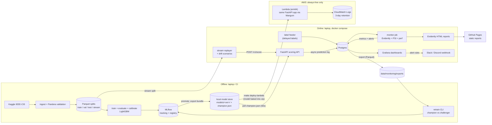

# FraudWatch — Transaction Fraud Detection with Drift Monitoring

**Implementation Plan (v1)** · Working name: `fraudwatch` · Planning date: 2026-10-04

---

## 0. Assumptions

I made no clarifying round-trip; these defaults drive the design. If any are wrong, the affected sections are noted.

| # | Assumption | If wrong, revisit |
|---|---|---|
| A1 | Built mostly by coding agents (Claude Code), with you as reviewer and decision-maker. No GPU. Laptop is an Apple Silicon Mac (arm64) with Docker Desktop and ≥ 16 GB RAM. | §4, §10 |
| A2 | **Budget is $0, a hard constraint.** The full system (API, Postgres, monitoring, Grafana, MLflow) runs locally in docker compose. AWS hosts only the scoring endpoint, and only on **always-free** services with guardrails (§10). The portfolio relies on a recorded demo + a static GitHub Pages site, not a 24/7 live dashboard. | §3, §10 |
| A3 | Public GitHub repo. Raw dataset is **never** committed or baked into images. | §2 licensing, §9 CI design |
| A4 | Region `us-east-1`. AWS free-tier terms below are as known at planning time — re-verify on the AWS Free Tier page before deploying. | §10 |
| A5 | **Python 3.14** (latest stable; 3.15 is still a release candidate, has no wheels for pyarrow/pyyaml/onnxruntime, and is preview-only on Lambda). Lambda `python3.14` is supported until mid-2029. Versions below are what `uv.lock` resolved on 2026-10-04 (latest at the time); upgrades are deliberate, never incidental. | §4 |
| A7 | You need to be able to defend every design decision in an interview without the agent present. Your review and understanding time is treated as a deliverable, not overhead. | §11 |
| A6 | Target audience is hiring managers for MLE roles: they skim README for 60 seconds, and maybe read the blog post. Demonstrable engineering judgment > leaderboard score. | §12 |

**Guiding principle:** every component must answer "what breaks or becomes invisible without this?" If the answer is "nothing in v1", it goes to the stretch list.

---

## 1. Goals and Non-Goals

### v1 Goals
1. **Reproducible training pipeline**: one command from raw Kaggle download → validated, time-split Parquet → trained, evaluated, registered model. Same inputs + seed ⇒ same metrics.
2. **Real-time scoring API**: FastAPI service returning a calibrated fraud probability + decision, p95 latency < 50 ms at 50 req/s locally; the same app deployed to AWS Lambda for a $0 cloud endpoint.
3. **Single source of truth for features**: training and serving share one feature module; a parity test proves they produce identical vectors.
4. **Stream simulation**: replay held-out transactions in simulated time, with named, reproducible drift scenarios (gradual covariate shift, prior shift, concept drift, data-quality incident) and **delayed labels**.
5. **Monitoring**: feature drift, prediction drift, data quality, and (label-delayed) performance — stored as time series, visualized in Grafana, with alert rules to a webhook.
6. **Manual retraining loop**: CLI that builds a champion-vs-challenger comparison on recent matured labels, applies a promotion gate, and hot-swaps the served model.
7. **$0 AWS deployment** of the scoring endpoint (Lambda + Function URL) via Terraform, with zero-spend guardrails and a one-command teardown.
8. **Portfolio packaging**: README with results and demo GIF, ADRs for key decisions, blog post.

### Non-Goals for v1 (explicitly deferred)
| Non-goal | Why deferred |
|---|---|
| Matching Kaggle leaderboard scores | Top solutions relied on user-history aggregations that require an online state store; the point here is the system, not the last 0.01 AUC. |
| Kafka / Kinesis streaming | No component needs a durable log; HTTP replay demonstrates the same scoring contract. Mentioned as the scale-up path. |
| Feature store (Feast, SageMaker FS) | v1 features are request-contained + static lookups shipped with the model. |
| Stateful velocity features (per-card rolling counts) | Requires Redis/DynamoDB and point-in-time correct backfills. Stretch phase. |
| Fully automated retraining | Designed and documented (§6.7), not built. |
| Shadow / canary deployments | Described as part of automated retraining design. |
| Autoscaling, HA, multi-AZ | Wrong cost profile for a personal project. |
| Hosted 24/7 monitoring stack (Postgres, Grafana, MLflow in the cloud) | No always-free option fits it; it runs locally and is shown through video, screenshots and static reports. |
| Deep learning / GNN models | GBDTs are the industry default for tabular fraud; DL would add cost without a story. |
| Per-request explanations (SHAP) | Stretch; global SHAP plots are in v1 evaluation report. |

---

## 2. Dataset Choice

### Candidates

| | **IEEE-CIS Fraud Detection** (Vesta) | **PaySim** (synthetic mobile money) | **ULB Credit Card Fraud** (Kaggle `mlg-ulb/creditcardfraud`) |
|---|---|---|---|
| Size | ~590k labeled train transactions (+ ~507k unlabeled test) | ~6.36M rows | 284,807 rows |
| Fraud rate | ~3.5% | ~0.13% | ~0.17% (492 frauds) |
| Time span | ~6 months (`TransactionDT`, seconds from an unknown reference) | 744 hourly steps (~30 days) | **2 days** |
| Features | ~430 columns across transaction + identity tables; mix of interpretable (amount, product, card type, email domain, device) and anonymized (C, D, M, V groups) | ~10 interpretable columns | 28 PCA components + Time + Amount |
| Realism | Real e-commerce data | Synthetic; fraud only occurs in `TRANSFER`/`CASH_OUT`, and balance-column arithmetic nearly leaks the label | Real, but PCA-anonymized |
| Drift simulation | Natural temporal drift exists; interpretable columns (amount, product, email domain) allow meaningful injected drift | Easy to regenerate with the simulator, but leakage makes performance trivial | PCA features make injected drift meaningless to explain |
| Time-based validation | Good: ~6 months allows train/val/test/stream split | Weak: 30 days | Not viable: 2 days |
| Licensing | Kaggle **competition rules**: must accept rules on Kaggle; data use for non-commercial/academic purposes; **no redistribution** | CC BY-SA 4.0 | Database Contents License (DbCL) v1.0 |
| Recognizability | High among fraud/ML interviewers | Medium | Very high, but seen as "the tutorial dataset" |

### Recommendation: **IEEE-CIS Fraud Detection**

Reasons:
1. **Time span supports honest time-based validation** and leaves a full, untouched month to stream. Neither alternative does.
2. **It drifts naturally.** Raw `D*` columns (time-deltas) shift as time passes, and the distribution of email domains and products changes across months. That gives a non-synthetic drift story alongside the injected scenarios.
3. **Interpretable columns make drift scenarios explainable** ("transaction amounts inflated 40%", "product C share tripled").
4. **Signals seniority**: messy, wide, partially-missing data with a two-table join is closer to real work than PCA features.

Main costs: feature width (handled by a curated input contract, §5.3) and licensing restrictions (below).

### Licensing handling
- Download via the Kaggle API in `make data` (`kaggle competitions download -c ieee-fraud-detection`); the user must accept the competition rules once on Kaggle.
- **Never** commit raw/processed data, put it in a Docker image, or upload to a public bucket. `.gitignore` `data/`. The Lambda package contains the trained model only, never data.
- CI uses a **synthetic fixture generator** with the same schema (§9), so the public repo runs end-to-end without the real data.
- README states the license constraint and that results are reproducible after accepting the rules.
- *Fallback*: if the rules turn out to prohibit portfolio use on re-read, swap to PaySim **with balance columns removed** (to kill the leakage). The pipeline is dataset-agnostic behind `data/schema.py` + config, so this is a 1–2 day change. (See §13, R1.)

### Class imbalance (~3.5% positive)
Decisions, in order of preference:
1. **No resampling by default.** GBDTs handle 3.5% positives fine; SMOTE is rejected (synthetic points in a 400-dim mixed-type space are unrealistic and complicate time-ordered validation).
2. **Compare `scale_pos_weight ∈ {1, sqrt(neg/pos)≈5, neg/pos≈27}`** as a tuned hyperparameter, judged on PR-AUC.
3. **Calibrate afterward** if weighting distorts probabilities (isotonic regression, §5.5). Threshold selection operates on calibrated scores.
4. **Optional negative downsampling for fast experimentation** (e.g., keep 25% of negatives), with probability correction `p' = p / (p + (1−p)/w)` — used only for tuning speed, never for the final model.
5. Evaluate only with **imbalance-aware metrics** (§5.4). Accuracy is never reported.

---

## 3. Architecture

### Components

| Component | Responsibility | Runs where |
|---|---|---|
| **Ingest & validate** | Download, join transaction+identity, Pandera schema checks, time-based split to Parquet + manifest with SHA-256 hashes | Laptop / CI |
| **Training pipeline** | Feature build → train → evaluate → calibrate → select threshold → build model bundle → log to MLflow | Laptop (CI runs a tiny version) |
| **MLflow** | Experiment tracking + model registry (aliases `champion`/`challenger`) | Laptop (docker compose), SQLite backend, local artifact dir |
| **Model store** | Local `models/<version>/` (LightGBM model, encoders, calibrator, `manifest.json`) + `models/champion.json` pointer. **The serving contract**: the API never talks to MLflow. | Laptop filesystem (mounted into the API container) |
| **Scoring API** | FastAPI; validates request, builds features via shared module, scores, logs prediction asynchronously, polls champion pointer to hot-swap models | Laptop (compose) |
| **Cloud scoring endpoint** | The *same* FastAPI app wrapped with Mangum, model packaged inside the zip; logs predictions as JSON to CloudWatch | AWS Lambda (arm64) + Function URL, always-free tier |
| **Postgres** | `predictions`, `labels`, `drift_metrics`, `perf_metrics`, `alerts` tables | Laptop (compose) |
| **Stream replayer** | Reads stream split, applies drift scenario, posts to API on a simulated clock | Laptop (compose profile `sim`) |
| **Label feeder** | Releases ground-truth labels with a realistic delay distribution | Same process as replayer, separate task |
| **Monitor job** | Every N minutes: computes drift/data-quality/performance metrics for each closed simulated window; writes metrics; renders Evidently HTML report | Laptop (compose, scheduled loop) |
| **Grafana** | Dashboards + alert rules (provisioned as code) → Slack/Discord webhook | Laptop (compose) |
| **Retrain CLI** | Reads exported predictions+labels, trains challenger, compares with champion, applies gate, promotes | Laptop |
| **Static site** | Evidently reports, evaluation report, dashboard screenshots, demo video link | GitHub Pages (free) |

### Data flow (Mermaid)



### Key design decisions
- **API is decoupled from MLflow.** It loads a self-describing bundle from the model store (a local directory, or baked into the Lambda zip). This keeps the serving package small enough for Lambda (no `mlflow` dependency) and means MLflow never has to be hosted.
- **Event time ≠ wall time.** Every transaction carries a simulated `event_time`; all monitoring windows are defined on event time. This lets a 30-day stream replay in ~40 minutes and makes runs deterministic.
- **Monitoring is batch over a prediction log**, not in the request path. Scoring latency is unaffected by drift computation.
- **One app, two runtimes.** The same FastAPI app runs under uvicorn locally and under Mangum on Lambda; only the entrypoint and the prediction-log sink differ (`PostgresSink` locally, `StdoutJsonSink` → CloudWatch on Lambda).
- **Logging must never fail scoring.** Prediction logs go through an in-process queue with batched inserts; failures increment a counter and are logged, but the response is returned.

---

## 4. Tech Stack

| Concern | Choice | Why | Alternatives considered |
|---|---|---|---|
| Env / packaging | **uv** + `pyproject.toml`, `uv.lock` | Fast, lockfile-based reproducibility, one tool | Poetry (slower), pip-tools |
| Data | **pandas 3.0 + pyarrow 25**, Parquet | Ecosystem compatibility (Evidently, Pandera, sklearn) | Polars — faster, but friction with Evidently/Pandera; revisit if feature build > 2 min |
| Data validation | **Pandera 0.33** | Code-first schemas, works on DataFrames, lightweight | Great Expectations — heavy config surface for one dataset |
| Baseline model | **scikit-learn 1.9** `LogisticRegression` | Standard, interpretable baseline; also provides metrics, calibration | — |
| Main model | **LightGBM 4.7** | Fast on wide tabular data, native categorical + missing handling, small model files, fast CPU inference | XGBoost (comparable, slower on this width), CatBoost (strong on categoricals, slower training, larger dependency) |
| Tuning | **Optuna 5.0** (TPE, 50 trials, MedianPruner) | Simple, logs well to MLflow | Hyperopt, Ray Tune (overkill) |
| Experiment tracking + registry | **MLflow 3.16** — local server, SQLite backend, local artifact dir | Industry-recognized, registry aliases, free | W&B (free personal tier, but external SaaS dependency), SageMaker managed MLflow (paid) |
| Config | **pydantic-settings + YAML** files in `configs/` | Typed, validated, env-overridable, simple | Hydra — powerful for sweeps but Optuna covers that; adds indirection |
| API | **FastAPI 0.142 + Pydantic 2.13 + uvicorn 0.54** | Typed request validation, auto OpenAPI docs, async background tasks | BentoML (more opinionated), Flask (no typing), SageMaker endpoint (~$40+/mo min) |
| DB access | **SQLAlchemy 2.1 + psycopg 3.3**, Alembic migrations | Standard; migrations show production hygiene | Raw SQL (fine but no migrations) |
| Prediction/metrics store | **Postgres 18** (container) | One store for logs, labels, metrics; Grafana has a native datasource | SQLite (no Grafana-friendly concurrent access), RDS (~$12–15/mo), DuckDB on S3 (no concurrent writes) |
| Drift detection | **Evidently 0.7.23** (pinned exactly) wrapped behind our own `monitoring/drift.py` interface; PSI implemented in-house (~30 lines) | Evidently: rich per-feature tests + HTML reports. PSI in-house: the banking-standard metric, fully transparent, unit-testable. Wrapper protects from Evidently's API churn (it changed significantly in 0.7). | NannyML (great for label-free performance estimation → stretch), alibi-detect (more research-y), whylogs (profile-based, more infra) |
| Dashboard + alerting | **Grafana 13**, dashboards & alert rules provisioned from JSON/YAML in repo | Time-series native, alerting built in, "monitoring as code" | Streamlit (easy ML views, but DIY alerting, not what prod uses), Evidently UI (good reports, weak alerting) |
| Logging | **structlog** JSON to stdout; request-id correlation | Machine-parseable, cheap to ship to CloudWatch if wanted | stdlib logging (fine but more boilerplate) |
| Load testing | **Locust 2.46** | Python, scriptable, reports p50/p95/p99 | k6 (JS) |
| Lint/format/type | **ruff** (lint + format), **mypy** (on `src/`), **pre-commit** | Fast, single tool | black+flake8+isort |
| Tests | **pytest**, **hypothesis** (property tests for PSI & feature fns), FastAPI `TestClient` | — | — |
| Containers | **Docker**, multi-stage builds, `docker compose` with profiles; images built locally and in CI (no registry needed) | Everything that runs persistently runs locally | GHCR (free, but nothing pulls the images) |
| CI | **GitHub Actions** | Free for public repos, 4-core/16GB Linux runners | — |
| IaC | **Terraform 1.16**, AWS provider 6.x, local state | Readable, standard on MLE job postings | CDK (also fine; Terraform more common in postings), CloudFormation |
| Cloud compute | **AWS Lambda, arm64, zip package + Function URL**, FastAPI via **Mangum** | Always-free tier (1M requests + 400k GB-s/month, no 12-month expiry); Function URL avoids API Gateway; zip avoids ECR storage charges | EC2 / Fargate / SageMaker endpoint (all bill by the hour), Lambda container image (needs ECR, which is not always-free), Hugging Face Spaces (free, but not AWS) |
| Cloud access control | Function URL with **`AWS_IAM` auth** + reserved concurrency 2 | Unsigned requests are rejected before invocation, so strangers can't burn the free tier | Public URL + API key (abuse could still invoke the function) |
| Cost guardrails | **AWS Budgets zero-spend budget** + free-tier usage alerts + Terraform resource allowlist check in CI | Any spend above $0.01 emails you; CI blocks resource types that bill hourly | — |
| Static hosting | **GitHub Pages** | Free; the portfolio stays visible with nothing running | S3 static site (not always-free) |

---

## 5. Modeling Approach

### 5.1 Data splits (time-based, never random)

Sorted by `TransactionDT` (in days from start, ~183 days total). Exact boundaries live in `configs/data.yaml`:

| Split | Approx. days | Approx. rows | Purpose |
|---|---|---|---|
| **train** | 0 – 95 | ~305k | Model fitting; time-series CV folds for model selection |
| *gap* | 95 – 102 | ~23k (dropped) | Mimics label delay: in reality, the most recent week's labels are not yet known at training time |
| **validation** | 102 – 132 | ~97k | Early stopping, calibration fit, threshold selection, **drift reference set** |
| **test** | 132 – 153 | ~68k | Final holdout, touched once per model version (every touch logged in MLflow with a `test_eval` tag) |
| **stream** | 153 – 183 | ~98k | Never used in modeling; replayed through the API with drift scenarios |

- **Model selection** uses expanding-window time-series CV within train (3 folds, each validated on the following ~3 weeks). Changes are kept only if mean fold PR-AUC improves by ≥ 0.005 *and* doesn't regress on the latest fold.
- **Entity leakage note:** the same cards appear across splits. That's realistic (returning customers), but card-level ID features (`card1` etc.) are frequency-encoded rather than used as raw high-cardinality IDs, to avoid memorization.
- **Label semantics note:** in IEEE-CIS, once a card has a reported chargeback, subsequent transactions on the same account are also labeled fraud. Documented as a known property; it makes "account-level" signals strong.

### 5.2 Baselines (Phase 2)
1. **Prior baseline**: constant score = training fraud rate. PR-AUC ≈ base rate (~0.035). This is the floor every chart shows.
2. **Logistic regression** on ~15 interpretable features (log amount, product, card type, email provider group, hour-of-day, missing indicators), one-hot + standardization, `class_weight="balanced"`.
3. **LightGBM, default params**, on the curated feature set (§5.3), early stopping on validation.

*Rough sanity expectations (not targets):* LR well above prior but modest; default LightGBM a large step up in PR-AUC; ROC-AUC around 0.9. If LightGBM ≈ LR, suspect a feature bug.

### 5.3 Improvements (Phase 3), each as a tracked MLflow experiment with ablation
1. **Feature engineering (all request-computable or static lookups):**
   - `log1p(TransactionAmt)`, cents component (`amt % 1`), hour-of-day and day-of-week from `TransactionDT`.
   - **D-column normalization**: `Dn_norm = day − Dn`. Raw D columns are time-deltas that drift upward over time by construction; normalized versions are stable. *This is a real drift lesson for the blog.*
   - Email domain → provider group + TLD; `P_emaildomain == R_emaildomain` flag.
   - `DeviceInfo` → device family; identity-missing indicator (~75% of transactions have no identity row).
   - Frequency encodings for `card1`, `card2`, `addr1`, email domains — **fit on train only**, shipped in the bundle; unseen values → 0.
2. **Feature selection to an input contract of ~50 raw fields.** The ~339 `V` columns are heavily redundant (grouped by NaN pattern); keep one representative per correlated group via correlation clustering (|ρ| > 0.9), then prune by LightGBM gain. Acceptance: contract model is within 0.01 PR-AUC of the all-features model. This keeps the API payload sane and the monitoring surface tractable.
3. **Hyperparameter tuning**: Optuna, 50 trials on CV folds; search `num_leaves, min_child_samples, feature_fraction, bagging_fraction, lambda_l1/l2, learning_rate, scale_pos_weight`.
4. **Calibration** (§5.5).
5. **Seed stability**: final config retrained with 3 seeds; report mean ± std.

Explicitly excluded from v1: user-ID (`card1+addr1+D1n`) aggregations that drove top Kaggle solutions — they require per-entity state at serving time. They become the stretch phase that demonstrates point-in-time-correct online features.

### 5.4 Evaluation metrics

| Metric | Role | Why |
|---|---|---|
| **PR-AUC (average precision)** | **Primary** model-selection metric | Focuses on the positive class; insensitive to the huge number of easy negatives |
| **Recall @ precision ≥ 0.5** and **@ 0.8** | Operating-point summaries | "If analysts tolerate 1 false alarm per true fraud, how much fraud do we catch?" |
| **Recall @ FPR = 1%** | Customer-friction view | Bounds the share of legit customers inconvenienced |
| **Dollar recall** (fraud amount caught / total fraud amount) | Business view | Catching a $2,000 fraud matters more than a $5 one |
| **Expected cost / net savings at chosen threshold** | Threshold selection objective (§5.6) | Ties model to decisions |
| **Brier score, ECE (10 bins), reliability diagram** | Calibration | Thresholds and cost math require meaningful probabilities |
| **ROC-AUC** | Reported for comparability only | Kaggle used it; misleading alone under imbalance |
| **Slice metrics** (by `ProductCD`, `card6` debit/credit, identity present/absent) | Fairness-of-performance & robustness | Catches a model that's great on average but blind on a segment |
| **Latency p50/p95/p99, model size** | Serving | It's a real-time system |

All metrics computed by one `evaluation/metrics.py` module used in training, CI, monitoring, and retraining — so "PR-AUC" means the same thing everywhere.

### 5.5 Calibration
- Fit **isotonic regression** on the first half of validation (days 102–117), choose the threshold on the second half (days 117–132) to avoid optimistic threshold selection on the same data.
- Apply calibration only if it improves validation ECE by a meaningful margin (default: uncalibrated ECE > 0.02); otherwise ship identity calibrator. Decision logged in manifest.

### 5.6 Decision threshold
- **Cost model** (configurable in `configs/model.yaml`): FN cost = `TransactionAmt` (fraud loss); FP cost = `$10` (review + customer friction); TP cost = `$10` (review). 
- **Rule:** choose threshold *t* on calibrated scores that **minimizes expected cost on validation-B**, subject to **alert rate ≤ 5%** (review-capacity constraint).
- Report at *t*: precision, recall, dollar recall, alert rate, net savings vs. "flag nothing".
- Threshold is stored in `manifest.json`, re-selected on every retrain, and **alert rate is monitored online** — under prior shift, a fixed threshold silently changes the review workload.
- Plot: cost vs. threshold curve with chosen point marked (goes in README).

### 5.7 Model bundle (`manifest.json` excerpt)
```json
{
  "model_version": "2026-11-02-a1b2c3d",
  "git_sha": "a1b2c3d",
  "data_hashes": {"train": "sha256:...", "validation": "sha256:..."},
  "train_window": {"start_day": 0, "end_day": 95},
  "feature_contract": ["TransactionAmt", "ProductCD", "card1", "..."],
  "threshold": 0.31,
  "calibrator": "isotonic",
  "metrics": {"val_pr_auc": 0.0, "test_pr_auc": 0.0},
  "reference_profile": "reference_profile.parquet"
}
```
`reference_profile` stores PSI bin edges + category frequencies + score deciles computed on validation, so the monitor knows exactly what "normal" is **for this model version**.

---

## 6. Drift Monitoring Design

### 6.1 What we monitor

| Type | Question | Signal | Needs labels? |
|---|---|---|---|
| **Data quality** | Is the input broken? | Schema violations (API 422 rate), per-feature missing rate, unseen-category rate, out-of-range rate | No |
| **Feature (covariate) drift** | Has P(X) changed? | PSI per monitored feature vs. reference | No |
| **Prediction drift** | Has P(ŷ) changed? | PSI on score distribution; alert rate; mean score | No |
| **Prior / label drift** | Has P(y) changed? | Fraud rate in matured labels | Yes (delayed) |
| **Concept drift / performance** | Has P(y\|X) changed, i.e. is the model worse? | PR-AUC, recall/precision at threshold, dollar recall on mature windows | Yes (delayed) |

**Monitored features:** top 20 by LightGBM gain + `TransactionAmt` + `ProductCD` + all identity-missing indicators (~25 total). Monitoring all ~50 inputs inflates false alarms (multiple testing) for little gain; all 50 still appear in the Evidently HTML report.

### 6.2 Windows & reference
- **Reference** = validation split, scored by the model version being monitored (not training data — training scores are overfit).
- **Drift windows:** tumbling **1 simulated day** (~3.2k transactions). Minimum 1,000 rows, else window marked `insufficient_data`.
- **Performance windows:** rolling **7 simulated days** (~22k rows, ~750 frauds) for stable PR-AUC; computed only on **mature** windows (§6.4).
- Monitor job is **idempotent**: keyed on `(window_start, model_version, metric)`, so reruns don't duplicate.

### 6.3 Statistical tests and thresholds

**Why PSI rather than KS/chi-square p-values:** with n ≈ 3,000 per window, p-value tests flag tiny, operationally irrelevant differences, and their false-alarm rate depends on window size. PSI is an effect size with industry-standard bands (and is the standard in bank model-risk monitoring — a deliberate tie-in to my background).

| Check | Method | Warn | Alert |
|---|---|---|---|
| Numeric feature drift | PSI, 10 quantile bins from reference, ε = 1e-4 smoothing, separate NaN bin | PSI ≥ 0.10 | PSI ≥ 0.25 |
| Categorical feature drift | PSI on categories (top-K = 20 + `__other__` + `__unseen__` bins) | ≥ 0.10 | ≥ 0.25 |
| Dataset-level drift | Share of monitored features with PSI ≥ 0.25 | ≥ 20% | ≥ 30%, **or** any top-5 feature ≥ 0.25 |
| Prediction drift | PSI on score (reference decile bins) | ≥ 0.10 | ≥ 0.20 |
| Alert-rate drift | Window alert rate vs. reference alert rate | ±30% relative | ±50% relative |
| Missing rate | Δ vs. reference, per feature | +5 pp | +10 pp |
| Unseen categories | Share of rows with unseen value in any monitored categorical | 2% | 5% |
| Performance | 7-day PR-AUC vs. validation PR-AUC | −0.03 abs | −0.05 abs **and** upper bound of 95% bootstrap CI (200 resamples) below baseline |
| Recall @ threshold | vs. validation | −5 pp | −10 pp |

**Debounce:** drift alerts fire only after **2 consecutive windows** breach (reduces flapping). Data-quality alerts fire immediately (an upstream bug is urgent).

**Threshold calibration (empirical, done in Phase 5):** compute PSI for 500 bootstrap windows of size 3,200 drawn from validation itself (true "no drift"). Set each feature's effective threshold to `max(band threshold, 1.5 × p99 of no-drift PSI)`. Target: **≤ 1 false alert per 30-day no-drift replay**. Also run the test month (natural drift only) to show what "real" drift looks like.

Evidently runs the same windows in parallel with its default tests (Wasserstein for numeric, Jensen-Shannon for categorical at n > 1000) to generate the HTML report; our PSI drives alerts. If they disagree substantially, that's a blog-post finding, not a bug.

### 6.4 Delayed labels
Real chargebacks arrive 30–90 days later. In simulation (compressed so the demo fits in a 30-day stream):
- **Fraud labels**: delay ~ LogNormal with median **3 simulated days**, 95th percentile ~10 days.
- **Legit labels**: confirmed when a transaction reaches the **maturity horizon of 10 simulated days** with no fraud label.
- A performance window is **mature** when `now_sim − window_end ≥ 10 days`. Only mature windows produce official performance metrics and alerts.
- **Provisional** metrics on immature windows are computed and shown in a separate, visually de-emphasized panel with a "biased: early labels only" note — early-arriving labels are not a random sample.
- **Proxies while waiting**: prediction drift and alert-rate drift are the early-warning signals. *Stretch:* NannyML CBPE (confidence-based performance estimation), with the documented caveat that it assumes calibration holds and **cannot detect concept drift** — demonstrating that limitation in the concept-drift scenario is a strong blog section.

Labels table records `label_time` so every metric is reproducible "as of" any simulated moment.

### 6.5 Drift simulation scenarios
All scenarios are deterministic (seeded), defined in `configs/scenarios/*.yaml`, applied by the replayer to the stream split. Default timing: drift starts day 5 of the stream, ramps linearly to full strength by day 15.

| Scenario | Transform | Expected detection |
|---|---|---|
| `baseline` | None (natural month-6 drift only) | Few/no alerts; establishes false-alarm rate |
| `amount_inflation` (gradual covariate) | `TransactionAmt *= 1 + 0.6·ramp(t)` | `TransactionAmt` PSI alert ~day 9–11; performance roughly stable (model robust) — shows **drift ≠ degradation** |
| `product_mix_shift` (covariate + prior) | Resample so `ProductCD == "C"` share rises from ~12% → 40% (C has higher fraud rate) | `ProductCD` PSI, prediction drift, alert-rate alert; fraud rate rises in mature labels |
| `fraud_surge` (prior shift) | Oversample fraud rows so fraud rate 3.5% → 7% | Prediction drift + alert-rate; precision rises, recall stable |
| `fraudster_adaptation` (**concept drift**) | For fraud rows only, replace the top-5 most important features with values sampled from legit rows (same time window) | **Feature drift stays quiet** (fraud is ~3.5% of rows); prediction drift weak; **only mature-label performance alerts catch it** — the key demo |
| `pipeline_bug` (data quality) | From day 12, `card6` becomes null and `TransactionAmt` arrives in cents (×100) for 50% of rows | Immediate missing-rate and amount PSI alerts |

Each scenario has a test asserting the transform does what it claims (§9).

### 6.6 Alert delivery
- Monitor job writes `drift_metrics` and `perf_metrics` rows with `status ∈ {ok, warn, alert}`.
- Grafana alert rules (provisioned YAML) query `status = 'alert'` per check type → contact point: **Discord or Slack incoming webhook** (free). Message includes check, feature, value, threshold, window, and a link to that window's Evidently report.
- `alerts` table keeps history for the README timeline chart.

### 6.7 Retraining

**v1 (manual) — `fraudwatch retrain --as-of <sim-date>`:**
1. Export: predictions + labels from Postgres → date-partitioned Parquet in `data/monitoring/exports/`, done by the monitor job once per simulated day and on demand.
2. Build training set: original train+validation **plus** stream transactions with **mature** labels up to `as_of − maturity`. Recency weighting: stream rows weight 3× (configurable; ablated in blog).
3. Hold out the most recent 5 mature days as the comparison window.
4. Train challenger with the champion's hyperparameters (no re-tuning by default — faster, isolates data effect).
5. **Promotion gate** (all must pass):
   - Challenger PR-AUC on recent holdout ≥ champion + 0.01
   - Challenger PR-AUC on the original test split ≥ champion − 0.02 (didn't forget the old world)
   - No slice drops > 0.05 PR-AUC
   - p95 latency (offline benchmark) within 20% of champion
6. On pass: set MLflow alias `champion`, export bundle to the model store, update `champion.json`. Local API picks it up within 60 s; `make deploy-lambda` publishes it to the cloud endpoint (new Lambda version, `live` alias moved, so rollback is moving the alias back). Monitor job switches reference profile to the new version.
7. Everything recorded: data window, export hashes, git SHA, gate results.

**Automated retraining (designed, not built; this is the funded-production design, not part of the $0 build):**
- **Trigger policy:** (a) mature-label performance alert, **or** (b) dataset-level drift alert sustained ≥ 5 windows **and** ≥ 500 new mature fraud labels since last training, **or** (c) scheduled floor (monthly). Cooldown: 7 days. Drift alone with stable performance does *not* retrain.
- **Orchestration:** monitor job emits event → EventBridge → Step Functions: `export → train (SageMaker Training job or ECS RunTask) → evaluate → gate → shadow deploy`.
- **Shadow deployment:** challenger scores all traffic in parallel for N days (logged, not acted upon); compare on matured labels.
- **Human approval** step for promotion (Step Functions task token → Slack button), then **automatic rollback** if online metrics degrade within 72 h.
- MLflow moves to a hosted tracking server (or SageMaker managed MLflow) since the laptop can't be in the loop.

---

## 7. Repository Structure

```
fraudwatch/
├── README.md
├── PLAN.md
├── CLAUDE.md                   # agent conventions, commands, pinned versions, "do not" list
├── Makefile                    # make data | train | up | demo | test | deploy-lambda | smoke-lambda | destroy
├── pyproject.toml / uv.lock
├── .pre-commit-config.yaml
├── .github/workflows/
│   ├── ci.yml                  # lint, type, tests, mini-eval, docker build
│   ├── lambda-package.yml      # build Lambda zip, enforce size limits, smoke-test handler locally
│   ├── pages.yml               # publish static reports to GitHub Pages
│   └── full-eval.yml           # workflow_dispatch: real-data regression check (Kaggle secret)
├── configs/
│   ├── data.yaml               # split boundaries, paths, storage URIs
│   ├── features.yaml           # feature contract, monitored features
│   ├── model.yaml              # hyperparams, cost model, threshold constraints
│   ├── monitoring.yaml         # windows, PSI thresholds, debounce, maturity
│   └── scenarios/*.yaml        # drift scenarios
├── src/fraudwatch/
│   ├── config.py               # pydantic-settings models loading YAML
│   ├── data/                   # download.py, schema.py (Pandera), split.py, synthetic.py
│   ├── features/               # build.py — THE shared feature code (train + serve)
│   ├── training/               # train.py, tune.py, calibrate.py, threshold.py, bundle.py, register.py
│   ├── evaluation/             # metrics.py, slices.py, plots.py, regression_check.py
│   ├── serving/                # app.py, schemas.py, model_store.py (poll + atomic swap), sinks.py, lambda_handler.py (Mangum)
│   ├── simulation/             # replayer.py, scenarios.py, labels.py, clock.py
│   ├── monitoring/             # psi.py, drift.py (Evidently wrapper), quality.py, performance.py, job.py, export.py
│   ├── retraining/             # retrain.py, gate.py, promote.py
│   └── cli.py                  # Typer CLI: fraudwatch <cmd>
├── db/migrations/              # Alembic
├── docker/
│   ├── api.Dockerfile
│   ├── worker.Dockerfile       # monitor job + replayer
│   └── compose.yaml            # profiles: core (api, postgres, grafana, monitor), sim, mlflow
├── grafana/
│   ├── dashboards/*.json
│   └── provisioning/           # datasources, alert rules, contact points
├── infra/terraform/            # main.tf, lambda.tf, iam.tf, logs.tf, budgets.tf, outputs.tf
├── infra/allowed_resources.txt # CI fails if Terraform declares any other resource type
├── notebooks/01_eda.ipynb      # the ONLY notebook; outputs cleared in CI (nbstripout)
├── tests/
│   ├── unit/  data/  api/  model/  monitoring/  simulation/
│   └── conftest.py             # synthetic fixture
├── reports/
│   ├── baseline_metrics.json   # committed: metrics the regression check compares against
│   └── figures/                # committed PNGs used in README
└── docs/
    ├── adr/                    # 0001-dataset.md, 0002-psi-vs-pvalues.md, 0003-api-decoupled-from-mlflow.md, ...
    ├── runbook.md              # local stack, Lambda deploy, teardown, alert response
    └── blog/                   # draft post
```

---

## 8. MLOps and Engineering Practices

| Practice | Implementation |
|---|---|
| **Experiment tracking** | Every `train`/`tune`/`retrain` run logs to MLflow: params, config YAML as artifact, git SHA, dirty flag, data hashes, all §5.4 metrics, plots (PR curve, calibration, cost curve, SHAP summary), the bundle. Runs refuse to log as "official" if the git tree is dirty (override flag for exploration). |
| **Model versioning / registry** | MLflow registered model `fraudwatch-lgbm`; aliases `champion`, `challenger`. Version string = `YYYY-MM-DD-<gitsha>`. `champion.json` in the model store is the deployment pointer; the Lambda `live` alias points at the cloud copy; the registry is the audit trail. |
| **Reproducibility** | `uv.lock`; seeds in config; data manifest with SHA-256 of raw + split files; `make reproduce MODEL=<version>` retrains from a manifest and asserts metrics within ±0.002. |
| **Data versioning** | Raw data is immutable (Kaggle); splits are deterministic from config → hashes suffice. DVC rejected for v1 (no changing raw data to version). Monitoring exports are append-only, date-partitioned Parquet. |
| **Docker** | Multi-stage builds, non-root user, slim Python base. API image target < 400 MB (no MLflow, no Evidently). Healthchecks in compose. The Lambda zip is built from the same serving dependency group in `pyproject.toml`, inside an arm64 Lambda build image so native wheels match the runtime. |
| **CI (`ci.yml`, every push/PR)** | `ruff check` + `ruff format --check` → `mypy src/` → `pytest -m "not slow"` → **mini-eval**: generate 20k-row synthetic dataset with planted signal, run full pipeline (features → train → bundle → API load → score), assert PR-AUC ≥ 0.6 on synthetic and that the bundle loads in the API → `docker build`. Target: < 8 minutes. |
| **Full-data regression (`full-eval.yml`, manual)** | Downloads IEEE-CIS via `KAGGLE_KEY` secret, trains, runs `regression_check.py` against `reports/baseline_metrics.json` (fail if PR-AUC drops > 0.01 or any slice drops > 0.03). Run before merging model-affecting changes. |
| **Config management** | All tunables in `configs/*.yaml`, loaded into pydantic models (validated at startup — bad config fails fast). Env vars override per runtime (`FRAUDWATCH_RUNTIME=lambda`, `FRAUDWATCH_LOG_SINK=stdout`). No magic numbers in code. |
| **Logging** | structlog JSON; every request gets `request_id`, logged with `model_version`, latency, decision. No raw payloads in app logs (they're in Postgres). On Lambda, stdout goes to CloudWatch Logs with 3-day retention (always-free covers it). |
| **Code quality** | pre-commit (ruff, mypy, nbstripout, end-of-file), conventional commits, PR template with "how was this tested". |
| **ADRs** | One short markdown per significant decision (context / decision / consequences). Cheap to write, very strong portfolio signal. |

---

## 9. Testing Strategy

| Layer | Tests | Tooling |
|---|---|---|
| **Unit** | Feature functions: deterministic, NaN-safe, unseen categories → defined default; D-normalization math; email grouping; PSI equals hand-computed values on small arrays, PSI(x, x) ≈ 0, symmetric-ish behavior, handles empty bins (hypothesis property tests); threshold selection picks the min-cost point on a constructed example; label maturity logic; promotion gate logic (table-driven). | pytest, hypothesis |
| **Data validation** | Pandera schemas on raw joined data and on processed splits (dtypes, ranges, allowed categories, `isFraud ∈ {0,1}`). Split tests: no temporal overlap, gap respected, no duplicate `TransactionID` across splits, fraud rate per split within [2%, 6%]. Serving schema generated from the same feature contract (single source). | Pandera, pytest |
| **Training–serving parity** | Take 1,000 validation rows → features via batch path vs. per-row API path → assert identical vectors (within 1e-9) and identical scores. **The most important test in the repo.** | pytest |
| **API** | 200 on valid single + batch; 422 on wrong types / missing required fields; optional identity fields omitted → still scores; response contains `model_version`, `threshold`, `request_id`; `/ready` false before model load; hot-swap: replace `champion.json` in a fake store → version changes without dropped requests; prediction logging failure does not fail the request. | FastAPI TestClient, testcontainers-postgres |
| **Load** | Locust: 50 rps for 5 min on target instance type; assert p95 < 50 ms, error rate < 0.1%. Run manually per release; results committed to `reports/`. | Locust |
| **Model quality / regression** | Mini-eval in CI (synthetic, wiring); full-data regression check vs. `baseline_metrics.json` (manual workflow). Behavioral tests: invariance (changing `TransactionID` doesn't change score), directional sanity (score finite and in [0,1] for extreme amounts), slice floors. | pytest |
| **Simulation** | Each scenario produces its intended effect: `amount_inflation` raises median amount by ~1.6× at full ramp; `fraudster_adaptation` keeps marginal PSI of transformed features < 0.1 overall while fraud-conditional PSI > 0.5; `pipeline_bug` null rate correct after day 12; same seed ⇒ identical output. | pytest |
| **Monitoring** | Detector fires on synthetic shifted data and stays quiet on bootstrap no-drift windows (false-alarm rate ≤ 5% per feature-window); debounce requires 2 windows; job idempotency (run twice → same rows); immature windows never produce official perf metrics. | pytest |
| **Lambda** | Handler test: a Function URL event fixture → Mangum → 200 with the same score as the local app. Package-size check (< 50 MB zipped, < 250 MB unzipped). Cold-start import time measured. | pytest |
| **Infra / cost** | `terraform validate` + `fmt -check` + tflint; **resource allowlist check**: parse `terraform show -json` plan and fail if any resource type is outside `infra/allowed_resources.txt`. | tflint, small Python script |

Coverage target: ≥ 80% on `src/fraudwatch/` excluding `cli.py` and plotting. Coverage is reported, not gamed.

---

## 10. Deployment Plan ($0)

**Hard constraint: $0.** The whole system runs locally in docker compose; that's the "production-like" environment and where the demo is recorded. AWS hosts only the scoring endpoint, using services whose **always-free** tier fully covers the expected usage, behind guardrails so neither a mistake nor a stranger can create a bill.

### What runs where

| Piece | Where | Cost |
|---|---|---|
| API, Postgres, monitor job, replayer, Grafana, MLflow | Laptop, docker compose | $0 |
| CI, mini-eval, full-data regression check, Lambda package build | GitHub Actions (public repo) | $0 |
| Cloud scoring endpoint | AWS Lambda (arm64, 512 MB) + Function URL | $0 within always-free tier |
| Cloud logs | CloudWatch Logs, 3-day retention | $0 within always-free tier |
| Static site: Evidently reports, eval report, screenshots, demo video link | GitHub Pages | $0 |
| Demo video | YouTube (unlisted) or a GitHub release asset | $0 |

**Deliberately not used:** EC2, Fargate, RDS, NAT Gateway, Elastic IPs, SageMaker (all bill by the hour); **S3** and **ECR** (only free for 12 months on older accounts, so the model goes *inside* the Lambda zip and there are no container images in AWS); API Gateway (Function URL is free and enough).

### Lambda design
- **Same app, different entrypoint:** `serving/lambda_handler.py` wraps the FastAPI app with Mangum. Same request schema, same feature code, same parity guarantees.
- **Zip package, no container.** Limits: 50 MB zipped for direct upload, 250 MB unzipped including layers. Keep the serving dependency group lean: `numpy`, `lightgbm`, `fastapi`, `pydantic`, `mangum`. If the feature module needs pandas, use AWS's public managed **AWS SDK for pandas** layer (free) rather than bundling it. Store the isotonic calibrator as two arrays applied with `np.interp`, so scikit-learn isn't needed at serve time.
- **Model baked into the zip** (bundle is a few MB; `reference_profile` excluded since monitoring is local). Promotion to cloud = `make deploy-lambda` → publishes a new Lambda version → moves the `live` alias. Rollback = move the alias back.
- **Batch endpoint first:** the replayer can send up to 1,000 transactions per call, so a full 98k-transaction stream is ~100 invocations.
- **Logging:** `StdoutJsonSink` writes one JSON line per prediction → CloudWatch. The full monitoring loop runs against the **local** API; the Lambda endpoint demonstrates the cloud deployment, with a smoke test and latency test.
- **Latency reporting:** p95 SLO applies to warm invocations; cold start is measured and reported separately (expect on the order of 1–2 s with LightGBM + numpy imports). Being upfront about it is better than hiding it.

### Free-tier headroom (always-free, does not expire)

| Resource | Free per month | Expected use |
|---|---|---|
| Lambda requests | 1,000,000 | < 25,000 (demo replays via batch endpoint + one load test of ~15k requests) |
| Lambda compute | 400,000 GB-s | < 2,000 GB-s (15k req × ~0.1 s × 0.5 GB ≈ 750 GB-s for the load test) |
| CloudWatch Logs ingest / storage | 5 GB / 5 GB | < 0.5 GB with 3-day retention |
| Data transfer out | 100 GB | negligible |

That leaves more than 100× headroom on every line.

### Guardrails (how $0 is enforced, not just estimated)
1. **Account plan.** If you create a new AWS account, pick the **Free account plan** (introduced July 2025). Under that plan AWS doesn't charge the account; it's closed after 6 months or when the signup credits run out unless you upgrade. Re-read the current terms at signup. The portfolio doesn't depend on the endpoint staying live (static site + video), so the 6-month limit is acceptable; afterwards, either let it lapse or upgrade and rely on guardrails 2–6. On an existing account, guardrails 2–6 apply.
2. **`AWS_IAM` auth on the Function URL.** Unsigned requests are rejected before the function runs, so public traffic can't consume quota. The demo client signs requests with SigV4 (botocore).
3. **Reserved concurrency = 2**: caps how hard even signed traffic can hit the function.
4. **AWS Budgets zero-spend budget** (the console's "Zero spend budget" template; alerts when spend exceeds $0.01) plus **free-tier usage alerts** in Billing preferences. Create the budget once, **outside Terraform**, so it survives teardown.
5. **Resource allowlist in CI:** Terraform may only declare `aws_lambda_function`, `aws_lambda_alias`, `aws_lambda_function_url`, `aws_iam_role`, `aws_iam_role_policy(_attachment)`, `aws_cloudwatch_log_group`. Anything else fails the build.
6. **Local Terraform state** (no S3 backend, no DynamoDB lock table).

### What it *would* cost in a funded setup (interview talking point)
README includes a short table mapping each local component to its production AWS equivalent (ECS/EKS or SageMaker endpoint for the API, RDS for Postgres, SageMaker Model Monitor or a scheduled ECS task for monitoring, S3 for model store and exports, managed MLflow or SageMaker Model Registry, Amazon Managed Grafana), with rough monthly costs: about $30/month for a single small EC2 instance running the compose stack 24/7, and $50+/month for Fargate + ALB + RDS. That shows you know the paid architecture and chose not to pay for it.

### Commands
```
make up             # local stack (API, Postgres, Grafana, monitor, MLflow)
make demo           # run a drift scenario end to end, locally
make deploy-lambda  # terraform apply + publish new version + move `live` alias
make smoke-lambda   # signed request against the Function URL; checks score parity with local
make destroy        # terraform destroy
```

### Teardown runbook (`docs/runbook.md`)
1. `make destroy`: removes the Lambda function, URL, alias, IAM role, log group.
2. Check the Lambda and CloudWatch consoles in `us-east-1` for leftovers (e.g., a log group recreated by a late invocation).
3. Check the **Billing → Free Tier** page and **Bills** for $0.00; the zero-spend budget stays in place as a permanent backstop.

### Optional free extras (not in v1)
- **Hugging Face Spaces** (free CPU Docker Space): a public, clickable scoring demo. Sleeps when idle, not AWS.
- **Grafana Cloud free tier**: a hosted dashboard. Skipped because it would mean pushing metrics out of the laptop for little portfolio gain over a recorded demo.

---

## 11. Phased Milestones

Every phase ends with something runnable and a short demo note in `docs/progress.md`.

### 11.0 How to read the estimates (agent-built)

Coding time is no longer the bottleneck, so phases aren't estimated in developer-weeks. Each phase lists three things:

- **Agent work:** roughly how many focused agent sessions it takes (one session = one well-scoped task with acceptance checks it can run itself).
- **Compute floor:** wall-clock time no agent can shorten: training, tuning, scenario replays, CI runs.
- **Your time:** steps only you can or should do (accounts, credentials, licence acceptance, judgment calls) plus **review and understanding**: reading the critical diffs, rerunning the demo yourself, and writing down why each decision was made. That is what an interviewer is actually testing.

**Rough totals:** ~25–35 agent sessions, ~10–15 h of compute (mostly unattended), **~30–40 h of your time**. Elapsed time is set by how fast you review: about **2–3 weeks** if you review daily, longer if you batch it. More than half of your time is in Phases 3, 5 and 8, where the judgment calls are.

### 11.1 Working rules for agent-built phases

1. **Acceptance checks before code.** At the start of each phase, the agent turns the phase's acceptance criteria into executable checks (pytest tests, `make` targets, metric assertions). You approve them, then they're treated as locked: an agent may not weaken, skip or delete a locked test to get green. Changes to locked tests need a separate, explicitly reviewed commit.
2. **Repo memory.** `CLAUDE.md` holds conventions, commands and a "do not" list (no random splits, no raw data in git, no Terraform resources outside the allowlist, no un-pinned Evidently upgrades). ADRs give agents the *why* behind decisions so they don't re-litigate them.
3. **Mandatory human review** (the places agents produce plausible-looking but wrong ML code): split boundaries and gap, any feature touching time or IDs (leakage), the metric module, threshold/calibration data usage, PSI implementation, label-maturity logic, the promotion gate, and every Terraform change.
4. **Every metric must come from a real run.** Numbers in reports, README and blog are generated by scripts from MLflow or result files, never typed in by an agent. CI checks README figures against `reports/*.json`.
5. **Parallelism, at most 2 streams at a time** (git worktrees). Safe pairs: Phase 4 (serving, using the synthetic-fixture model) alongside Phase 3; drift scenarios + PSI (part of Phase 5) alongside Phase 4; Phase 7 Terraform alongside Phase 6. Phases 1→2→3 are sequential. More streams than that outruns your capacity to review them.
6. **"Explain it back" checkpoint** at the end of each phase: write 5–10 lines in `docs/progress.md`, in your own words, covering what was built, the key decision and what surprised you. If you can't write it, the phase isn't done. These notes become the raw material for the blog post.

### Phase 1 — Foundations & Data
**Budget:** agent ~3–4 sessions · compute minutes (download + split) · **you ~3 h**: accept the IEEE-CIS rules on Kaggle and re-read them for portfolio use (R1), create the Kaggle API token and add it as a GitHub secret yourself, review the split code and EDA conclusions.

**Tasks**
- Repo skeleton (§7), uv, ruff, mypy, pre-commit, pytest, Makefile, GitHub Actions `ci.yml` (lint + tests).
- `fraudwatch data download|validate|split`: Kaggle download, transaction+identity join, Pandera raw schema, time-based splits to Parquet, manifest with hashes.
- Synthetic fixture generator (same schema, planted signal, seeded).
- `notebooks/01_eda.ipynb`: fraud rate over time, missingness by group, D-column drift over time, amount distribution, ProductCD fraud rates. Conclusions copied into `docs/eda.md`.
- ADR-0001 (dataset choice).

**Acceptance criteria**
- `make data` on a clean clone produces 4 splits + manifest; re-running yields identical hashes.
- Split tests and Pandera validation pass; CI green on synthetic fixture.

**Demo:** `make data` output + EDA summary with 3–4 charts.

### Phase 2 — Baselines & Experiment Tracking
**Budget:** agent ~3–4 sessions · compute < 30 min · **you ~3–4 h**: review `metrics.py` and the threshold code line by line; sanity-check baseline numbers against §5.2 expectations.

**Tasks**
- `features/build.py` v1 (interpretable features), shared module design.
- `evaluation/metrics.py` with all §5.4 metrics + plots.
- Prior, logistic regression, and default LightGBM baselines.
- MLflow via docker compose (SQLite + local artifacts); logging helpers.
- Threshold selection with cost model; calibration check.
- Evaluation report generator (markdown + PNGs).

**Acceptance criteria**
- `make train MODEL=lr|lgbm` logs a complete MLflow run (params, config, hashes, metrics, plots).
- LightGBM beats LR on validation PR-AUC; all three baselines in a comparison table.
- Metrics module unit-tested against sklearn reference values.

**Demo:** MLflow UI comparing 3 runs; PR curve + cost curve.

### Phase 3 — Model Improvement & Registry
**Budget:** agent ~4–5 sessions · compute **~3–5 h** (ablations, 50 Optuna trials × 3 CV folds, 3-seed reruns; run unattended or overnight) · **you ~5–6 h**: decide which feature groups to keep from the ablations, review every time- and ID-based feature for leakage, approve the feature contract, decide on calibration.

**Tasks**
- Feature engineering (§5.3) with ablation runs per feature group.
- Feature contract selection (~50 raw fields); `configs/features.yaml`.
- Time-series CV; Optuna tuning (50 trials); 3-seed stability.
- Calibration (isotonic, split validation); final threshold.
- Model bundle + `manifest.json` + `reference_profile`; MLflow registry + aliases; `promote` exports to the local model store.
- `regression_check.py` + committed `baseline_metrics.json`; one-time test-set evaluation.
- Mini-eval job in CI. ADR on feature contract.

**Acceptance criteria**
- Tuned model improves validation PR-AUC over default LightGBM (record actual delta; if < 0.01, document honestly and keep the simpler config).
- Contract model within 0.01 PR-AUC of all-features model.
- `make reproduce` reproduces metrics within ±0.002.
- CI mini-eval passes in < 8 min total pipeline.

**Demo:** results table (prior → LR → LGBM default → LGBM tuned+features), calibration plot, slice table.

### Phase 4 — Serving API
**Budget:** agent ~3–4 sessions · compute < 1 h (load tests) · **you ~3 h**: review the parity test (is it really comparing the batch and online paths?) and the hot-swap logic. The Lambda spike runs locally in AWS's public Lambda base image, so no AWS account is needed yet.

**Tasks**
- FastAPI app: `/v1/score`, `/v1/score/batch` (≤ 1,000), `/v1/model`, `/health`, `/ready`.
- **Lambda packaging spike (≤ 2 h, do it early):** build the serving zip for arm64 and confirm LightGBM's native library (it needs OpenMP/`libgomp`) loads in the Lambda Python runtime and fits size limits. Fallback: export the model to ONNX and serve with `onnxruntime`.
- Pydantic request schema generated from feature contract.
- `model_store.py`: load bundle, poll `champion.json` every 60 s, atomic swap.
- Postgres + Alembic schema; async batched prediction logging.
- API Dockerfile (multi-arch), compose `core` profile.
- Parity test, API tests, Locust load test.

**Acceptance criteria**
- `make serve` → `curl` scoring works locally; OpenAPI docs render.
- Parity test passes on 1,000 rows.
- p95 < 50 ms at 50 rps locally.
- Lambda spike result recorded (works as-is, or fallback chosen) in an ADR.
- Killing Postgres does not cause scoring errors (logging degrades gracefully, counter increments).

**Demo:** `curl` → response with score/decision/version; Locust report.

### Phase 5 — Stream Simulation & Drift Detection
**Budget:** agent ~5–6 sessions · compute **~4–6 h** (6 scenarios × full replay + no-drift bootstrap calibration; use batch "fast mode" for iteration and real-rate replays only for final runs) · **you ~6–8 h**: review PSI and label-maturity code, judge whether each scenario is realistic, and look at the false-alarm calibration result before thresholds are locked.

**Tasks**
- Simulated clock; replayer (configurable rps, "fast mode" via batch endpoint).
- Six drift scenarios (§6.5) + their tests.
- Label feeder with delay distribution; labels table.
- `monitoring/psi.py`, quality checks, Evidently wrapper; monitor job (idempotent, windowed); `drift_metrics` / `perf_metrics` tables; maturity logic; bootstrap CIs.
- Empirical threshold calibration on no-drift bootstrap windows; record false-alarm rate.
- Evidently HTML report per window.
- ADR-0002 (PSI vs p-values), ADR on label delay.

**Acceptance criteria**
- `baseline` scenario: ≤ 1 alert over 30 simulated days.
- `amount_inflation`: `TransactionAmt` alert by simulated day ~11.
- `pipeline_bug`: data-quality alert in the first window after day 12.
- `fraudster_adaptation`: performance alert fires on mature windows; feature-drift alerts do **not** fire (or the gap between them is documented).
- Full 30-day scenario replay completes in < 45 min wall time.

**Demo:** run a scenario, query `drift_metrics`, open the Evidently report for an alerting window.

### Phase 6 — Dashboard, Alerting & Retraining Loop
**Budget:** agent ~4–5 sessions · compute ~2–3 h (end-to-end demo runs + retrains) · **you ~4 h**: create the Discord/Slack webhook, review the promotion gate, run `make demo` yourself start to finish and judge whether the recovery story is honest.

**Tasks**
- Grafana provisioned from repo: dashboards (Overview: traffic, latency, alert rate, model version; Drift: PSI heatmap feature × day with thresholds; Performance: mature vs provisional PR-AUC/recall with maturity shading; Data quality).
- Grafana alert rules + webhook contact point; annotations for model promotions.
- Export job (Postgres → Parquet).
- `retrain` CLI, promotion gate, promote → API hot swap; reference profile switch.
- `make demo SCENARIO=fraudster_adaptation`: one command running drift → alert → (manual) retrain → recovery.

**Acceptance criteria**
- Alerts arrive in Discord/Slack with link to window report.
- After `fraudster_adaptation` + retrain at simulated day ~20, post-retrain 7-day PR-AUC recovers **meaningfully** toward baseline (target: recover ≥ 50% of the drop; document actual result either way).
- Gate correctly rejects a deliberately bad challenger (test with shuffled labels).
- Grafana annotation shows the version switch at the right simulated time.

**Demo:** screen recording of the full loop — the centerpiece of the portfolio.

### Phase 7 — $0 AWS Deployment
**Budget:** agent ~2–3 sessions · compute < 1 h · **you ~3 h**, mostly human-only: create or choose the AWS account and plan, set up the zero-spend budget and free-tier alerts, configure local AWS credentials (agents shouldn't create accounts or handle your credentials), review every Terraform plan before apply, and check Billing a week later.

**Tasks**
- Zero-spend budget + free-tier alerts (manual, once, outside Terraform); choose the account plan (§10, guardrail 1).
- Terraform: Lambda (arm64, 512 MB, reserved concurrency 2), `live` alias, Function URL with `AWS_IAM` auth, IAM role, log group (3-day retention).
- `lambda-package.yml`: build zip in an arm64 Lambda build image, size check, handler test.
- Resource allowlist check + tflint in CI.
- `make deploy-lambda`, `make smoke-lambda` (SigV4-signed client), `make destroy`.
- Locust against the Function URL: one 5-minute run at 50 rps (~15k requests, well inside free tier); record warm p95 and cold-start time.

**Acceptance criteria**
- `make deploy-lambda` from scratch works in < 5 min; `make destroy` leaves nothing behind.
- Unsigned request to the Function URL → 403; signed request → score identical to the local API for the same payload.
- Warm p95 recorded (target < 100 ms at the URL, including network); cold start recorded.
- Billing shows **$0.00** one week after deployment; CI rejects a test PR that adds a disallowed resource (e.g., `aws_instance`).

**Demo:** `make smoke-lambda` output next to the local response, plus the CloudWatch log line for that prediction.

### Phase 8 — Portfolio Polish
**Budget:** agent ~2–3 sessions (figures, README draft, Pages workflow) · compute ~1 h (final runs that regenerate every figure) · **you ~8–10 h**: record the narrated demo, rewrite the README pitch in your voice, and **write the blog post yourself** from your `progress.md` notes. An agent can outline and fact-check it, but readers and interviewers can tell when a post wasn't written by the person defending it.

**Tasks**
- README (§12), figures in `reports/figures/`, demo GIF (≤ 60 s) + 3–5 min narrated video.
- Static snapshot: Evidently reports + dashboard screenshots on GitHub Pages so the work is visible when AWS is off.
- Blog post; "SageMaker equivalents" table (endpoint, Model Monitor, Model Registry, Pipelines) to show AWS fluency and justify the cheaper choice.
- Final ADR pass, cleanup, tag `v1.0.0`.

**Acceptance criteria**
- A stranger can go from clone to `make demo` (local, synthetic or real data) following README alone. Test it with a friend, or with a fresh agent session that has no repo memory, as a cheap first pass.
- README conveys the project in < 60 seconds of skimming.

### Stretch (post-v1, pick 1–2)
1. **Online velocity features** (Redis): per-card counts/amount sums over 1h/24h, point-in-time-correct backfill for training, parity test extended. *Highest MLE signal.*
2. **CBPE label-free performance estimation**, showing where it works (prior shift) and fails (concept drift). NannyML 0.13 only supports Python < 3.13, so implement CBPE directly (it's ~50 lines on top of calibrated scores) or run NannyML in a separate pinned environment.
3. **Shadow deployment** of challenger with online comparison.
4. **Automated retraining** via GitHub Actions `workflow_dispatch` triggered by alert webhook (cheapest real implementation of §6.7).
5. Per-request SHAP reason codes in the API (adverse-action style — ties to banking compliance background).

---

## 12. Portfolio Presentation

### README contents (in order)
1. **One-line pitch + badges** (CI, coverage, license, Python version).
2. **Demo GIF**: drift scenario starts → PSI heatmap reddens → alert lands in Discord → retrain → performance recovers.
3. **"What this demonstrates"** — 5 bullets mapped to MLE job requirements (reproducible pipelines, serving with SLOs, training/serving parity, monitoring with delayed labels, IaC + cost control).
4. **Architecture diagram** (Mermaid from §3).
5. **Results**:
   - Model comparison table: prior / LR / LGBM / LGBM tuned — PR-AUC, recall@P=0.8, dollar recall, ECE (validation + test).
   - Operating point: threshold, precision, recall, alert rate, estimated net savings.
   - Serving: p50/p95/p99 latency at 50 rps, image size, instance type.
   - Drift scenario matrix: scenario × (detected by which check, detection delay in simulated days, performance impact, recovered after retrain?).
6. **Key charts** (PNG): PR curve with operating point; cost-vs-threshold curve; reliability diagram; PSI heatmap (feature × day) for one scenario with alert markers; performance-over-time with label-maturity shading and retrain annotation; latency histogram.
7. **Quickstart**: `make data && make train && make demo` (and synthetic-data mode for those without Kaggle access).
8. **Design decisions**: links to ADRs with one-line summaries.
9. **Limitations & what I'd do next** (honest list).
10. **$0 design**: what runs where, free-tier guardrails, and the funded-production equivalent table.

### Blog post outline: *"Building a fraud model is the easy part: drift, delayed labels, and the plumbing that makes ML production-ready"*
1. **Hook**: in fraud, the model you deploy starts going stale on day one, and you won't know for weeks because labels arrive late.
2. **Setup**: dataset choice and why not the famous credit-card dataset (2 days of PCA features can't teach drift).
3. **Modeling decisions**: time-based splits with a label-delay gap; why PR-AUC, not ROC-AUC; cost-based threshold; calibration. Include the results table.
4. **Failure #1 (likely)**: random-split vs time-split gap — quantify how much a random split overstates performance.
5. **Failure #2 (likely)**: raw D-columns — natural drift baked into the features, and the normalization fix.
6. **Serving**: decoupling from MLflow, training/serving parity test and the bug it caught (there will be one).
7. **Monitoring**: PSI vs p-values at n=3,000 (show false-alarm rates); the no-drift calibration experiment.
8. **The concept-drift punchline**: fraudster adaptation is invisible to feature drift monitors; only labels catch it, and labels are late. What that means for monitoring strategy.
9. **Retraining**: what recovered, what didn't, recency weighting ablation, why drift alone shouldn't trigger retraining.
10. **Running it for $0**: local-first architecture, the Lambda endpoint, guardrails, and what the SageMaker/ECS version would look like and cost.
11. **What I'd do with a team and a budget**: online features, shadow deploys, automated retraining.
12. **Results recap + links.**

Rule for the post: report actual numbers, including things that didn't work. A credible "this didn't recover fully, here's why" beats a suspiciously clean story.

---

## 13. Risks and Open Questions

| # | Risk / question | Impact | Recommended default / mitigation |
|---|---|---|---|
| R1 | **IEEE-CIS competition rules may restrict use outside the competition.** | Could force a dataset swap late | Re-read rules in Phase 1 before any other work. Never redistribute data. Fallback: PaySim minus balance columns (pipeline is dataset-agnostic behind schema + config). |
| R2 | 30-day stream is short for drift → mature labels → retrain → evaluate recovery. | Phase 6 recovery evidence may be noisy | Compressed label delays (§6.4); drift starts day 5; 7-day perf windows. If still too thin: shrink test split to 14 days and give stream 37 days. |
| R3 | Concept-drift recovery may be weak (few post-drift fraud labels). | Less impressive demo | Recency weighting; report honestly; that's still a valuable finding. |
| R4 | Injected drift looks artificial. | Interviewers discount it | Ground each scenario in a real-world story (inflation, merchant mix, fraud ring, ETL bug); include the `baseline` natural-drift result. |
| R5 | Feature-width/payload complexity. | API + monitoring bloat | ~50-field contract (§5.3); monitor 25 features. |
| R6 | Evidently API churn. | Breakage on upgrade | Pin exact version; wrap behind `drift.py`; PSI (which drives alerts) is in-house. |
| R7 | Laptop resources: full stack + monitor job in Docker Desktop. | Slow or OOM locally | Give Docker Desktop ≥ 6 GB; monitor job processes one window and only monitored columns at a time; stop MLflow while replaying. |
| R8 | LightGBM native library (OpenMP) or package size doesn't fit Lambda zip limits. | Cloud endpoint blocked | Spike in Phase 4 (not Phase 7); fallbacks: managed pandas layer, slimmer deps, ONNX + onnxruntime. |
| R9 | Accidental AWS charge (wrong resource, free tier exceeded, abuse). | Money | Free account plan if new account; IAM-auth URL; reserved concurrency; zero-spend budget; CI resource allowlist; nothing that bills hourly; teardown check. |
| R10 | Scope creep (Kafka, feature store, k8s). | Never finishing | Stretch list is the only place new ideas go until `v1.0.0` is tagged. |
| R11 | **Agent-built code you can't defend.** The project works, but in an interview you can't explain why the gap is 7 days or how PSI handles empty bins. | Undermines the whole portfolio goal | Mandatory review list (§11.1-3), "explain it back" checkpoints, blog written by you. Budget your review time as seriously as the build. |
| R12 | **Agents gaming checks**: weakening tests, hardcoding numbers, silently swapping random splits in to "fix" a failing metric. | Wrong results that look right | Locked acceptance tests (§11.1-1), generated-only metrics (§11.1-4), CI asserts split boundaries and that test files weren't weakened in feature PRs. |
| R13 | **Plausible but subtly leaky ML code**, e.g. frequency encodings fit on all data, or calibration and threshold chosen on the same rows. | Inflated metrics | Leakage-focused review of `features/` and `training/`; a dedicated test that fitted encoders only ever see train-split rows. |
| R14 | **Agents use outdated library APIs** (Evidently, MLflow 2→3 and pandas/LightGBM all changed recently). | Churn, broken code | Pin versions on day 1; `CLAUDE.md` names the pinned versions; agents must run code, not just write it. |
| Q1 | Public live demo? | Can't host the full stack for $0 | **Default: no.** Recorded demo + GitHub Pages site; the Lambda endpoint is signed-request only. Optional later: a Hugging Face Space for a public scoring demo. |
| Q2 | Alert channel: Slack vs Discord vs email? | Minor | **Default: Discord webhook** (free, no workspace admin needed). |
| Q3 | Terraform vs CDK? | Minor | **Default: Terraform** (more common in MLE postings). |
| Q4 | Run MLflow in the cloud? | Cost | **Default: no**, laptop only. Stretch 4 (automated retraining via GitHub Actions) would log to a local-file MLflow store uploaded as a workflow artifact, still $0. |
| Q5 | Include stateful velocity features in v1? | ~3–4 more agent sessions + Redis + ~4 h of your leakage review | **Default: stretch.** Strongest stretch item; do it first if time allows. |
