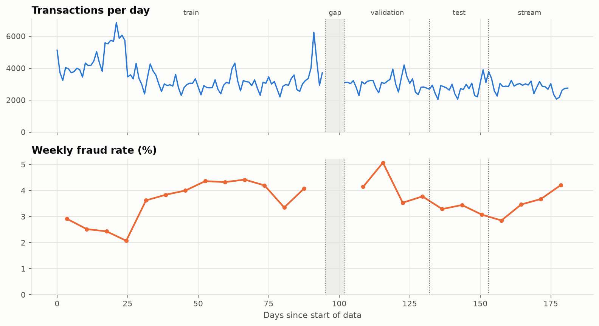
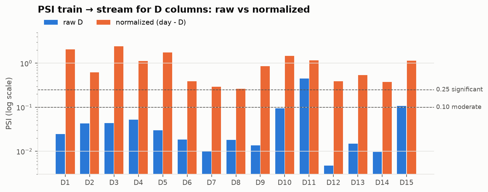
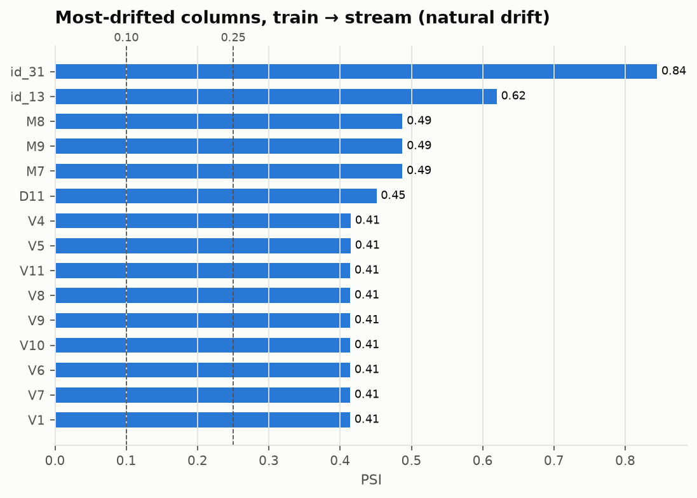
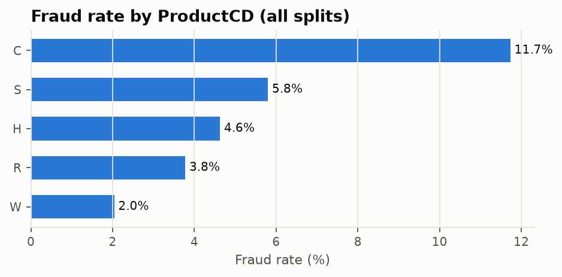
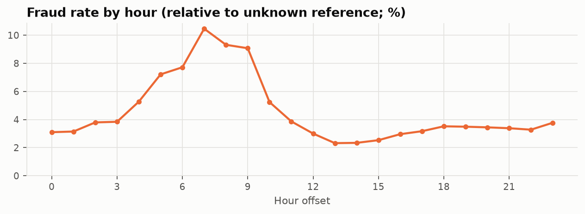
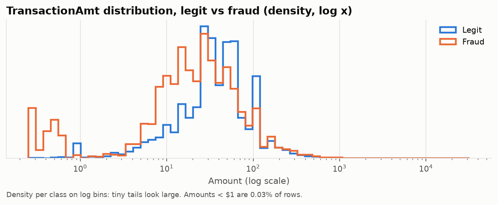

# EDA findings: IEEE-CIS

Source: [`notebooks/01_eda.ipynb`](../notebooks/01_eda.ipynb) (run with `make eda`). All numbers are
read from [`reports/eda_summary.json`](../reports/eda_summary.json), which the notebook generates.
Only aggregates are shown; no raw rows (dataset licence).

## The fraud rate is not stable

Across 24 full weeks the fraud rate ranges from 2.1% to 5.1%. Validation (4.05%) runs higher than
train (3.38%). The early part of train also has a volume surge (days ~17–25) with an unusually low
fraud rate.

**Implications:** the decision threshold is tuned on validation, so it is tuned at a different prior
than the model trained on. Alert-rate (prior-shift) monitoring must tolerate this natural week-to-week
range before it alerts.

## The plan's D-column hypothesis was wrong

PLAN §5.3 expected raw `D*` columns (time deltas, e.g. days since the card was first seen) to drift
upward over time, and `day − D` to be stable. The data shows the opposite. Raw D columns are mostly
stable from train to stream (PSI < 0.1, except D11 at 0.45 and D15 at 0.11). The normalized version
is effectively a *date*: 65% of stream rows have a value later than anything in training, so it
drifts by construction (PSI 0.26–2.4).

**Implications:** keep raw D columns as features. Use normalized D only as part of an entity key
(for example card1 + addr1 + D1n for per-card aggregations, a Phase 3 stretch), never as a feature.

## A block of columns becomes far less missing after training

| Column (representative) | train | validation | test | stream |
|---|---|---|---|---|
| M7 (also M8, M9) | 72.8% | 38.2% | 42.3% | 38.9% |
| V1 (also V2–V11) | 60.1% | 32.1% | 30.0% | 28.7% |
| D11 | 60.1% | 32.1% | 30.0% | 28.7% |

This shift is the largest source of natural drift (PSI ≈ 0.41–0.49 for these columns). It looks like
an upstream data-collection change. Because the monitoring reference is validation, the monitor will
not alert on it. But the model is trained on the one period where these columns are mostly empty.

**Implications (Phase 3 decision):** refit the final model on train + validation after model
selection, and/or drop or explicitly flag this block. Compare both.

## Natural drift is concentrated in a few columns

About 20 of 430 columns exceed PSI 0.25 against train in each later split. Apart from the
missingness block, the largest are `id_31` (browser version: chrome 63 → 66 as browsers update) and
`id_13`. The interpretable core (amount, product, card type, email domain, device type) stays below
0.1 against stream.

**Implications:** map browser and device strings to their family before modeling or monitoring, or
every browser release will trigger an alert. This supports monitoring a small, important feature set
with thresholds calibrated on natural drift (PLAN §6.3).

## Where the signal is

- **Strong:**
  - ProductCD: C 11.7% vs W 2.0%.
  - Identity row present: 6.7% vs 2.1% without (28% of train has one).
  - card6: credit 6.7% vs debit 2.4%.
  - DeviceType: mobile 10.1%, desktop 6.5%.
  - Hour offset: fraud peaks near 10% around hour 7, vs about 2.3% midday. The reference time is
    unknown, so hours are relative.
- **Weak:** amount alone (median $75 fraud vs $68.50 legit) and having a cents component.
- **Not a pattern:** the under-$1 cluster in the amount plot is 0.03% of rows and 0.1% of fraud.
  Per-class density on log bins exaggerates tiny tails.

## Missingness structure (for the API contract and feature reduction)

- The 339 V columns share only **14 distinct missingness masks** on train. Each group likely comes
  from one source system, which is a natural starting point for V-column reduction in Phase 3.
- Identity data exists for ~28% of transactions, so identity fields must be optional in the API
  contract.
